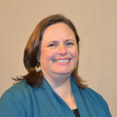

<table>
<tr>
    <td></td>
    <td><h3>Alice Myatt</h3>
            
Alice Myatt is the associate director of the Department of Writing and Rhetoric, which administers first-year composition courses at the University of Mississippi. She earned her Bachelor’s degree in English from the University of Mississippi and earned her Ph. D. in English with a concentration in Composition and Rhetoric from Georgia State University in Atlanta

    </td>
</tr>
<tr>
    <td></td>
    <td><h3>Ellen Shelton</h3>
            
 Ellen Shelton directs the UM Writing Project and Pre-College Programs in the Division of Outreach; she holds an Ed.D. in Curriculum and Instruction and a M.A. in English from the University of Mississippi, and taught high school for 15 years; in her spare time she plays the cello and spends time with her husband and her cat (not in that order).

    </td>
</tr>
</table>
